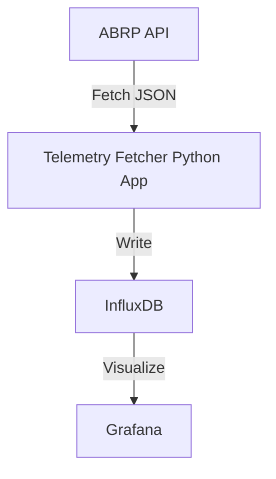
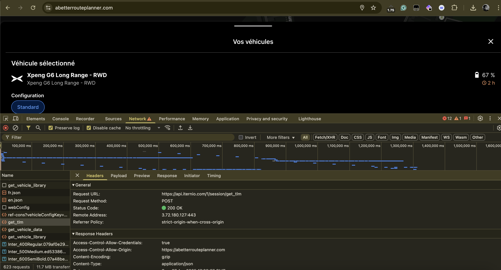
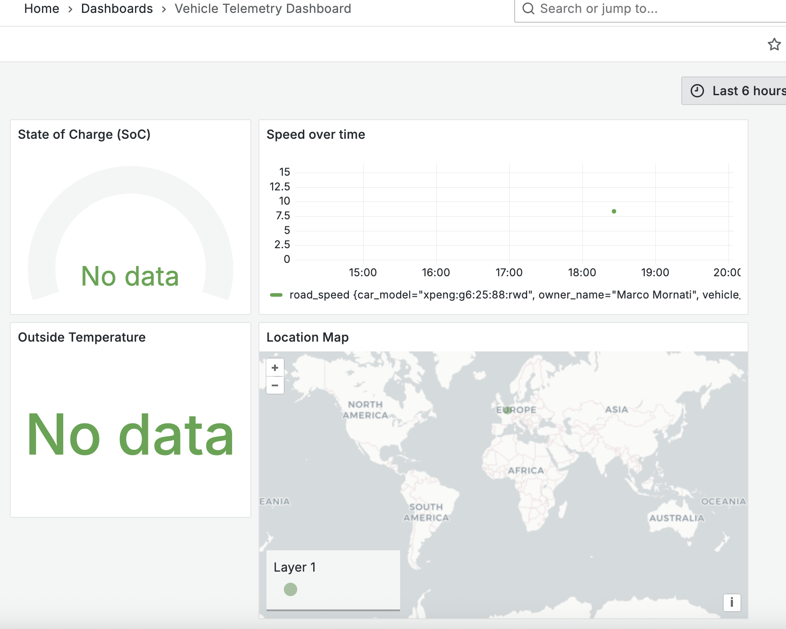

# Telemetry Fetcher and Charging Dashboard (aka XPeng Mate)

A simple, containerized project that fetches telemetry data from the ABRP API, stores it in InfluxDB, and visualizes it with Grafana. 🚗🔋📊

---

## Why this project?

The reason for the project is to bypass some actual limitation offered by the XPeng application and the missing of the XPeng API in Europe (looking on Chinese search engine, it seems APIs exists in China).

The best way to recover all the data, and the "official" one proposed so far is to use [Enode](https://enode.com/) but to get access to production/real vehicle data you need to have the confirmation from the Enode sale.
It is a quite complicated process at this stage (I personnally still not have access to the APIs even after sever requests :() so I proposed a way to bypass this limitation using the ABRP "API", but for this you need to subscribe to the ABRP premium account.

---

## Architecture Overview



---

## Prerequisites

- [Docker](https://docs.docker.com/get-docker/)
- [Docker Compose](https://docs.docker.com/compose/)

---

## Project Structure

```
/telemetry-project
|-- docker-compose.yml
|-- .env
|-- influxdb/
|   |-- config/
|-- grafana/
|   |-- provisioning/
|       |-- dashboards/
|           |-- *.json
|       |-- datasources/
|           |-- datasource.yml
|-- telemetry-fetcher/
|   |-- app/
|       |-- fetcher.py
|   |-- Dockerfile
|-- README.md
|-- images/
|   |-- logo/screenshots/...
```

---

## How to use it

### 1. Clone the repository

```bash
git clone https://github.com/mmornati/xpeng-mate.git
cd xpeng-mate
```

### 2. Configure the environment

Create a `.env` file based on the provided `sample.env`:

```dotenv
# API Configuration
API_URL=https://api.iternio.com/1/session/get_tlm
API_KEY=your-api-key-here
SESSION_ID=your-session-id-here
WAKEUP_VEHICLE_ID=your-vehicle-id-here

# InfluxDB Configuration
INFLUXDB_URL=http://influxdb:8086
INFLUXDB_TOKEN=your-token
INFLUXDB_ORG=your-org
INFLUXDB_BUCKET=my-bucket

# Grafana Configuration
GF_SECURITY_ADMIN_USER=admin
GF_SECURITY_ADMIN_PASSWORD=admin
```

#### 2.1 How to retrieve ABRP tokens
To get the `API_KEY`, `SESSION_ID` and the `WAKEUP_VEHICLE_ID` you can simply inspect a call made by your browser to the ABRP servers.
Just open on your browser the ABRP page and login, and look within the developer console the `get_tlm` call. In the Request preview (header and payload) you will have all the information to use to fill up the `.env` file.
 


### 3. Start all containers

```bash
docker compose up --build
```

It will spin up:
- InfluxDB (to store telemetry)
- Grafana (to visualize)
- Python app (fetching telemetry at regular intervals)

### 4. Access the services

- **Grafana**: [http://localhost:3000](http://localhost:3000)  
  Login with the credentials set in your `.env` file.

- **InfluxDB**: [http://localhost:8086](http://localhost:8086)

---

## Dashboard Preview



---

## Features

- Fetches telemetry data every X seconds.
- Automatically creates a dashboard to:
  - Display real-time GPS location.
  - Track charging sessions and locations.
  - Visualize state of charge (SoC) over time.
  - Analyze charging durations and energy metrics.
- Fully containerized and ready to deploy anywhere.

---

## Credits

- [A Better Route Planner (ABRP)](https://abetterrouteplanner.com/)
- [InfluxDB](https://www.influxdata.com/)
- [Grafana](https://grafana.com/)
- [Docker](https://www.docker.com/)

---

## License

Apache v2 License. See `LICENSE` for details.

---

> Made with ❤️ by EV Enthusiasts for EV Enthusiasts

